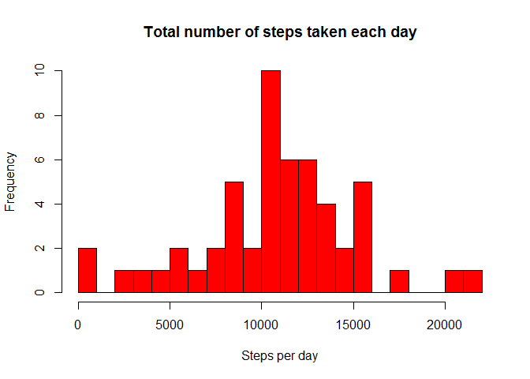
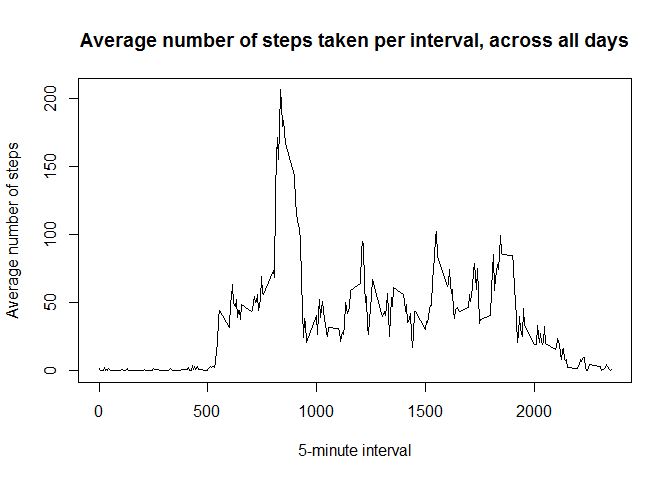
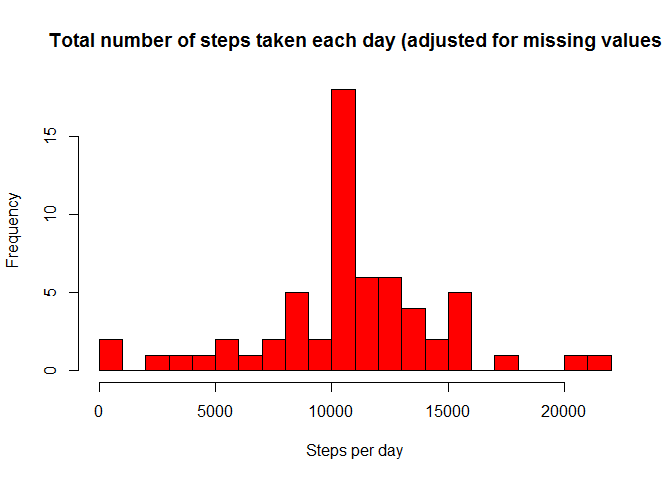
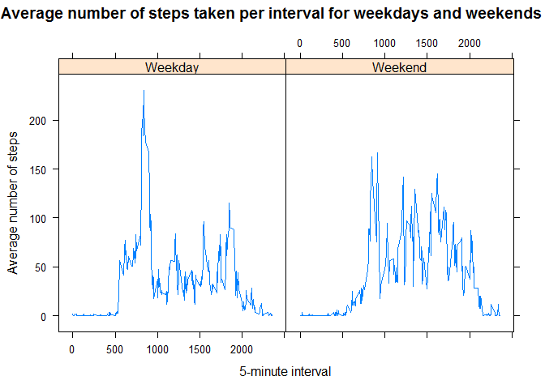

# Reproducible Research: Peer Assessment 1


```r
#set global options to always ECHO code block, as defined by assignment
library(knitr)
opts_chunk$set(echo=TRUE) 
```

## Loading and preprocessing the data
The followin dataset is used: 
[Activity monitoring data](https://d396qusza40orc.cloudfront.net/repdata%2Fdata%2Factivity.zip)
The column holding the date is changed to a date format. No other processing done on the data.


```r
data <- read.csv("activity.csv")
# change column date to be of type date
data$date <- as.Date(data$date, "%Y-%m-%d")
```

## What is mean total number of steps taken per day?
For this part of the assignment, I have ignored the missing values in the dataset and created a dataset with number of steps aggregated per day. An use this dataset to calculate the mean and median number of steps taken on a day.

```r
# create new dataset with number of steps aggregated by day.
dailydata <- aggregate(steps ~ date, data , sum)
```

####  1. The histogram of the total number of steps taken each day:


```r
hist(dailydata$steps, breaks = 20,col = "red", xlab = "Steps per day", 
     main = "Total number of steps taken each day")
```

 

#### 2. Calculate and report the **mean** and **median** total number of steps taken per day

```r
dailymean <- round(mean(dailydata$steps), 0)
dailymedian <- round(median(dailydata$steps),0)
```

The median total number of steps taken per day is **1.0765\times 10^{4}**  
The mean total number of steps taken per day is **1.0766\times 10^{4}**  

## What is the average daily activity pattern?
For this part of the assignment, I have ignored the missing values in the dataset and created a new dataset with the number of steps aggregated per interval.


```r
# create dataset that calculates mean per interval across days.
intervaldata <- aggregate(steps ~ interval, data , mean)
```

#### 1. Make a time series plot of the 5-minute interval (x-axis) and the average number of steps taken, averaged across all days (y-axis)


```r
plot(intervaldata$interval, intervaldata$steps, type = "l", ylab = "Average number of steps", xlab = "5-minute interval", main = "Average number of steps taken per interval, across all days" )
```

 

#### 2. Which 5-minute interval, on average across all the days in the dataset, contains the maximum number of steps?

```r
## order intervaldata by steps, and select last entry
highestinterval <- tail(intervaldata[order(intervaldata$steps),1],1)
highestavg <- tail(intervaldata[order(intervaldata$steps),2],1)
```
The interval **835** has the highest average of 206.1698113 steps.  

## Imputing missing values
There are a number of days/intervals where there are missing values (coded as `NA`). The presence of missing days may introduce bias into some calculations or summaries of the data.

#### 1. Calculate and report the total number of missing values in the dataset (i.e. the total number of rows with `NA`s)
To calculate the number of Na I first created a vector that defines if the row has a Na or not.
Then we use this vector to calculate the number of missing values for variable step and use this vector to input new values.


```r
# create vector with NA
missingvalue <- is.na(data$step)
numberNA <- nrow(data[missingvalue,])
```
The number of rows that have a missing value is:  **2304**

#### 2. Devise a strategy for filling in all of the missing values in the dataset. The strategy does not need to be sophisticated. For example, you could use the mean/median for that day, or the mean for that 5-minute interval, etc.
Chechking the data it seem that if data is missing for a particular interval on a day, all data for that day is missing:

```r
aggregate(interval ~ date, data[missingvalue,], length)
```

```
##         date interval
## 1 2012-10-01      288
## 2 2012-10-08      288
## 3 2012-11-01      288
## 4 2012-11-04      288
## 5 2012-11-09      288
## 6 2012-11-10      288
## 7 2012-11-14      288
## 8 2012-11-30      288
```
Therefor for the missing values I applied the, in the previous steps calculated, mean for that 5-minute interval. 


#### 3. Create a new dataset that is equal to the original dataset but with the missing data filled in.


```r
## First we create a dataset that is identical to origina dataset and then we add to this new dataset a value for the missing values.
cleandata <- data

## for each row in cleandata, determine if the steps value is missing
## if missing then set this missingvalue to the mean steps values for that interval
no <- nrow(cleandata)
for(i in c(1:no)) {
    if(is.na(cleandata[i,1])) {
        cleandata[i,"steps"] <- subset(intervaldata, interval ==cleandata[i,"interval"], select = c(steps))
    } else {}
}
```

#### 4. Make a histogram of the total number of steps taken each day and Calculate and report the **mean** and **median** total number of steps taken per day. 


```r
# aggregate the nummber of steps per day
dailydataclean <- aggregate(steps ~ date, cleandata , sum)
dailymeanclean <- round(mean(dailydataclean$steps),0)
dailymedianclean <- round(median(dailydataclean$steps),0)
```


```r
hist(dailydataclean$steps, breaks = 20,col = "red", xlab = "Steps per day", 
     main = "Total number of steps taken each day (adjusted for missing values")
```

 

The mean total number of steps take per day is **1.0766\times 10^{4}**  
The median total number of steps taken per day is **1.0766\times 10^{4}**  

#### 5. Do the **mean** and **median** values differ from the estimates from the first part of the assignment?What is the impact of imputing missing data on the estimates of the total daily number of steps?

The mean with missing values is = 1.0766\times 10^{4} after adding missing values 1.0766\times 10^{4}  
The median with missing values is = 1.0765\times 10^{4} after adding missing values 1.0766\times 10^{4}

There is no impact of imputing missing data on the estimates of the total daily number of steps. The reason for this is that all Na are for a whole day. By adding average steps to the days with missing steps, the average across the days is not going to change. 


## Are there differences in activity patterns between weekdays and weekends?
Yes, there are differences in activity patterns.

In order to see the difference we first add a column to dataset to determine if data is weekday or weekend.


```r
## add columns to the dataset to define day of week
cleandata$day <- NA
cleandata[,"day"] <- weekdays(cleandata[,"date"])
## add column to define weekday or weekend
cleandata$weekend <- NA
weekend <- cleandata$day %in% c("Saturday","Sunday")
cleandata[weekend,"weekend"] <- "Weekend"
cleandata[!weekend,"weekend"] <- "Weekday"
## aggregate data across the days
intervaldataweekend <- aggregate(steps ~ interval + weekend, cleandata , mean)
```
The following diagram show the average number of steps taken per interval for weekdays and weekends


```r
library(lattice)
xyplot(steps ~interval|factor(weekend), data = intervaldataweekend, type = "l", ylab = "Average number of steps", xlab = "5-minute interval", main = "Average number of steps taken per interval for weekdays and weekends" )
```

 
  
During weekdays there is a peak in the morning and during the weekend it looks like the total number of steps increased.

To test if total number of days increased during weekend we look at the totals per day.

```r
## add columns to the dataset to define day of week
dailydataclean$day <- NA
dailydataclean[,"day"] <- weekdays(dailydataclean[,"date"])
## add column to define weekday or weekend
dailydataclean$weekend <- NA
weekend <- dailydataclean$day %in% c("Saturday","Sunday")
dailydataclean[weekend,"weekend"] <- "Weekend"
dailydataclean[!weekend,"weekend"] <- "Weekday"
```

If we calculate the mean number of steps on a weekday and a weekend we get the following result, which shows that weekends more steps are made:

```r
## calculate the mean number of daily steps on a weekday and on a weekend
Weekendmean <- aggregate(steps ~ weekend, dailydataclean, mean)
print(Weekendmean)
```

```
##   weekend    steps
## 1 Weekday 10255.85
## 2 Weekend 12201.52
```

If we even go further and check the average number of steps per day we get the following result:

```r
## calculate the mean number of daily steps per day of the week
dayofweekmean <- aggregate(steps ~ day, dailydataclean, mean)
print(dayofweekmean[order(dayofweekmean$steps),])
```

```
##         day     steps
## 5  Thursday  8496.465
## 6   Tuesday  8949.556
## 2    Monday 10150.709
## 7 Wednesday 11676.910
## 1    Friday 12005.597
## 4    Sunday 12088.774
## 3  Saturday 12314.274
```
The two days with the most steps (on average) are Sunday and Saturday.
